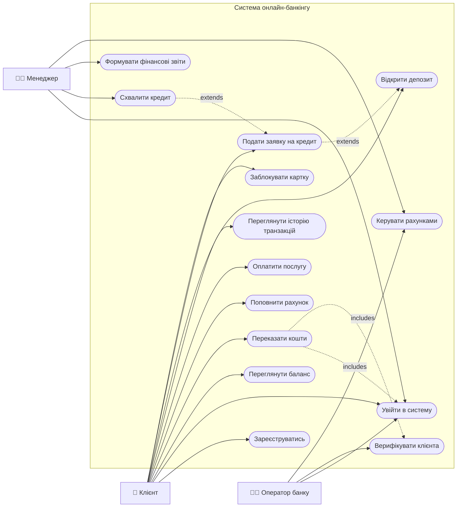
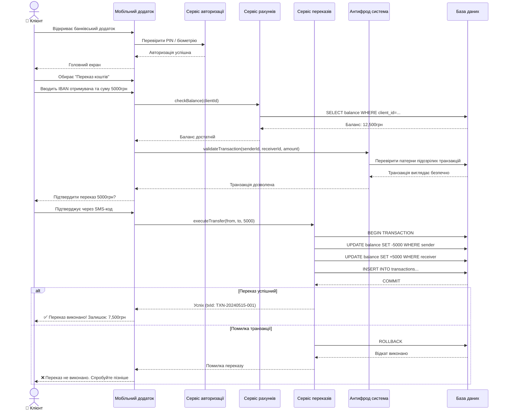
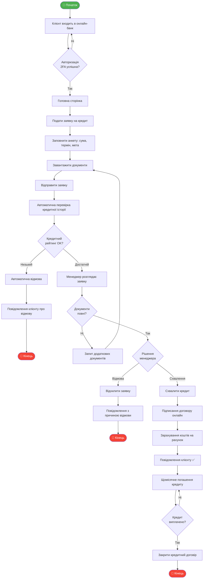

# Практичне заняття PZ-UML
## Система: Банківська система

---

## 🎯 Предметна область

**Онлайн-банкінг** — інформаційна система для управління банківськими рахунками, переказами, кредитами та фінансовими операціями клієнтів.

---

## 1. Use Case Diagram

**Актори:**
- **Клієнт** — керує рахунками, робить перекази, подає заявки
- **Оператор** — верифікує клієнтів, керує рахунками
- **Менеджер** — схвалює кредити, формує звіти

https://mermaid.live/edit#pako:eNp1VNFuEkEU_ZXNPGkChFl2YXcf-lIfNSYmvtjtw1rGllgWsl2SatuEltb4oDaSBhNjbBr7oG8I1LbQxV-Y-QW_oJ_gvbMssHRKAsyeOefOPWcu7JC1WpkRh6wHXn1De_zM9TV4bTVexgA_41diXxzwC37Duxof84iPeJdf8yjLf8Mi4kPRgc--aMVSfD1fpg9W-BfeFU1-IU6wgGiKFu8BciALflh9OE_Xgf6D96DSNRI03tPE_uxk0UrTC0A_hcpQnff5SBzzSLRiIfaEDUZiP60x5jRDIFzGvWjwMBbvcZnmm5I_5n_h3QODV5IN8q44AisRwMO0ogiK78AfTVzK6iAHJyNQ9BddlO51ITrS-RhC64hPGqYno4aeIe53GFO6lAWl2gAPYLuZHD2Autj9JQJpvj0xN0hCwDSOwedQtDQ4CG56KPsa3NXSfHy3EPUIQ5jdK2YJVw7L4aJXigPRlmavxCF0uiAbgdET8H_AuwtCHI0zcYRkOG9i7f7mcDS-4jlz9ecuDW_-ZvGqKc7GOcaNozaTHcrJlrOEQyA6mBN8zQ8L88uuHy-XNyvMD1dccnv6-VyDLqamXLIaU57WWeCFtSAm_frX_Hh72r7R5NhcyDblrWvTn1ZrKn3i-d46myh_TpXfIIdIZvEHK0j6fDtaNruEFhWYrsAKCsxQYKYCKyqwkgKzFJit6jmfWEliSze-gFKqhgtJlUmC6SJpkKpRQ4lOC0NEWjaXXdqt-GubjTLb2p3VV-4lrYLveJNthzBIcs9Ktqh-Z88mGfijrpSJEwYNliFVFlQ9fCQ7qHJJuMGqzCUOLMte8Nolrr8Hmrrnv6jVqoksqDXWN4jzytvcgqdGveyF7FHFg3_8GQWOZMFyreGHxKGGTWUR4uyQbeIYZs6iesEomHbJoDqFzTfEyepGrmiYxRK1DMOwdEPX9zLkrTw3n7PtYimfN6lVKlJKdXPvP5Yg0Qs

---

## 2. Sequence Diagram

**Сценарій: Переказ коштів між рахунками**

https://mermaid.live/edit#pako:eNqNVmtP21YY_itn5xPVkswOkIuldcptm1UIFTHaNEWaPNtA1FyY41R0CInAaPsBre2GijR1Q7v8gJAmI0AT_sLxX9gv2E_Yc45tcnOnIYHt4_d5L8_7vK_Zo0bDtKhCm9a3LatuWPmKvmXrtXKd4Ec3nIZNctWKVXeI3iT_nL_6k7Cf2Y372j1lQ_fQM9vRbadiVHZ0WG2o3JC9YSN24b6G5QkbsgG7IqyHox7ruIe4Xs8DMy1nW0B_Y333gHURok1YBzcA4GDALgF-iuOzELBhNFpejlN43HTcY_cIOVwjm-48UrP1enPTsudD34qHPrtGEpfh4E9tvWUK5EvOBhu43wOCMonbxkMbR332jnXmkfmsgL3ivlmHk9PhPLnH5bpn7JEevX9_Q1UI-xHxeyiB09BFSaeEXQiEqAqBTpDm-1jeUOGG0wtH535RvEY44zmTh2qRfEREu0bItu8eugd4_YOH5sBokMfLkHa8IO4Ryr3F7XNk1LkLCpBXBYA_wfUNfruBGvqiGpQQXvCvqG8gundKyvQubdELgsvIfY40eVNoKF8IxHlAge4JUbOZIgHkUOT9DnLgHD4D7ygGf9o4wSlZliSJvYXRcJI4T1oKMbYt41FWr-qYkgVDhFPNez5JnhHM81mFlAorhZxGvvFsyRefF9YLxEN8XTE_jsViHiqfjU4GEGq44Zy4bYXI8cjydDpBkKDICXPRd6E33vkhiLkKeBVFCKEq5LFerZi6YwnRY7grjfpC06qblq2aEWJbhlV57N3rNR7Kr06g_dpCFYRZ4XH5i6F4FHIdYWwO-A7guiaCfS5Z6Aa9f-rlOKbBT5H9PmsGgaFfA_YWy-SF0LZQfx8WfESfwXY0mWdAT6gjkZUQxw08CLWG6vWcV4CSuqKo3rjOSR2O9fJJmAhnffyFOTklSNjzcUlKq6Uo1zLrTTUrWEkKsXYto-W3CwcLm3ajFiFOIyJC-90J3voNyhY-wzxr65liKZPT1LViqNXGw3xGK9xJtFTQSJT79MXqieL_Ij-cQAYiCsWqxVJhXcNFWyPOWIPNmYkYE5BbW11VtYAdveqQmVUwtXoGgaKmQgft-MO3PCYLzq4KqWlfFqNxKb4kLcvLUUmS743B02r4-83xbFyhSN66odDY6APCzsQ4DpAJNq9CkrPja1WbFnfDd-wAltdi_8yJ9CykBI-99bWVlWwm92BsMEtX8J3g0ziX4n9QM53UzJfv6L20_HIyR8uQ9ecCx_iH9VZ8GC-waa_4pvB2xCVfVSCs7zNUN2mEbtkVkyqO3bIitGbZNZ0_0j1uUqbOtlWzylTBranbj_j23wcG39SvGo1aALMbra1tqmzqoDxCWzt85_n_2NyZCIXn-JajipxcWhROqLJHd_EsxWNxKbG0tJhMJRJxWY7QJ1RJyrFkOp1KpRKylFpMp5b2I_Q7EVWOycmEnEzL8WQyIaXj8uL-v6qdZps
---

## 3. Activity Diagram

**Процес: Оформлення та отримання кредиту**

https://mermaid.live/edit#pako:eNqNVt1O41YQfhXLe9OVAiJ2EsAXrRCUm_6KbW-acGGSE-Ju4pM6zu7SCIkfscsFaqotCtJqK9re9S4Nya75SXiFc16hT9BH6Mwc27HDghYJEfvMfOebb76Z0NHLvMJ0S6_W-fNyzfZ87bu1kqvBzxMfnj4p_nd-OtLEuZjIV6IvD8REXG0-1ubmPtW-5NuOWxRvxLXsyVMxlgeaGMgjiBiKQB7IE3jU4GksrkVfXIrxnPgHPowBQN1AAAS10vZrHfErpMMFck8E4j1c9hJwu6WSa6yvaPJQ7otbeHEMAP3PdhUC5gGAJn6XvSmnmbO_4NIrOl2zW7UtbnuVovgNiF3D7wDhNLmvLpY9pCf6QFCBxBmKZrNZ3ymiGFAiihFoRLQLMFfyUCMs-LQnRkqDsFDKI4R1p15f516jKM6A1W1IIFBQpI0YgXSHFlI6FDein9HgcASQN0guo8E7iCCKCB0BEvr3zTq3Kwp7gHAYKN5F-ENsHqGO6CgIMVQaITxpbzUcvyhew2VD0HuPkII7pcYCqYSoiXy1xspPi1EnkT-mgnVImVsqZASHPfh7NSMWxEzkmQZncTfk2WbcTIWtWJa5xzriTSo3EJfgFXp1iZfCqwvtmy_QKiFVzFJuQYPJE2AASTH3DfYjK_v3kh-QJDfUsn6ClkojlK-571R3ssohKh5hrlFvULwL5U6HBf2CAk9S0CQtQodYhPu5WzFoEocaFI0eHcFwnGw-vlvaKQiH8iH1MYSq8r6yXXubeRvsmcOeF8VbIoTSvcOOaMgCunsB5Lrk7NPZZuMlKRA1T7zc6uCVaVtBGyJry140qhibGtUN9lObtXx8H01DgCtkGE_XFWEE8uiOdaGwQcgqAZOYgXh-o1sTS4CVnZbD3Y74g9ZJ2BskfZPWRfQj7mEKIb1O-iBSt23XI_vQOazBAPr-wcEJtYxTEtYxHrDOe2UX9GNAo_JL2pNByjhGZBzzQeOkKvsTWOPamF4aLj2PP2PFxHFY1gcXHcZS3ip3fc9GRc7VMoG4fdpxVA7Wd0HEcdIPU18UIVqEoNrmtLbaXouRV7A38gj8MJgCglvksbKGWsRx0Ji-tMKCQ5iE6OZHz-u_b49SIpuhkZv2ToO5UOnfmE8LrEtrY6TRIFwAkeME6FS32BAxCEF-azuV1H5Dd0KLAQ0kAmjEmkSjhdEzoxWCzZxPh2C1zkMpic3dhqqFmmgTruyoL5gc-etBe7X8nTpT_0loVfimsh7lVlfW8wuZMq9zz3pUrVaTgQAXhlVzOdMs3B9mfGSceX-cntG3PaeiW77XZhm9wbyGjY96BzFKul9jDVbSLfhYsb2nJb3k7kJO03Z_4LwRpXm8vV3Trapdb8FTu1mxfbbm2NuePQ1hboV5q7zt-rplmPlFAtGtjv5Ct7Lm4ryRzy0uZ4388mIhXzAy-o5uzRWMwvxSPps180beXF4oGLsZ_We615hfWjCXF3MFYylfWM4ZS7v_Ayjk68U 
---

## 📋 Зв'язок між діаграмами

| Діаграма | Роль | Зв'язок |
|---|---|---|
| **Use Case** | Визначає 14 функцій для 3 акторів | UC "Переказати кошти" та "Кредит" деталізуються |
| **Sequence** | Показує транзакційну логіку з антифрод-системою | Реалізує UC "Переказати кошти" |
| **Activity** | Описує багатоетапний процес отримання кредиту | Охоплює UC "Подати заявку" + "Схвалити кредит" |

---

## ✅ Висновки

Змодельовано **систему онлайн-банкінгу** з:
- 3 акторами: Клієнт, Оператор, Менеджер
- 14 варіантами використання
- Транзакційною логікою (BEGIN/COMMIT/ROLLBACK) в Sequence Diagram
- Повним циклом кредитування з автоматичною перевіркою в Activity Diagram
